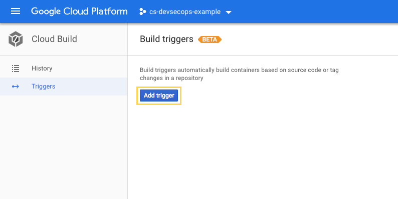
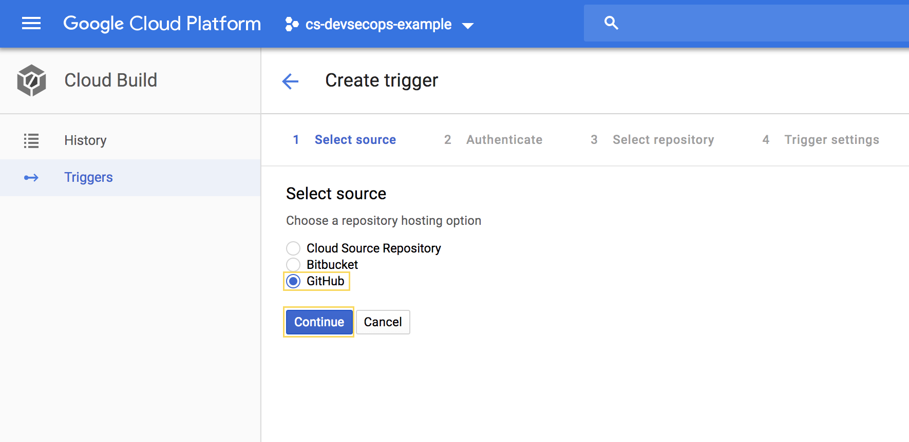
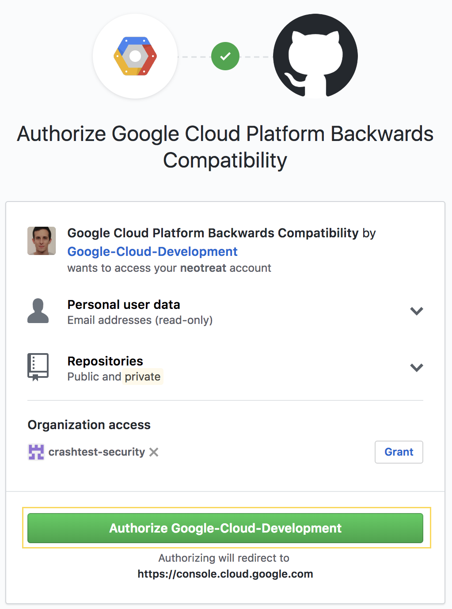
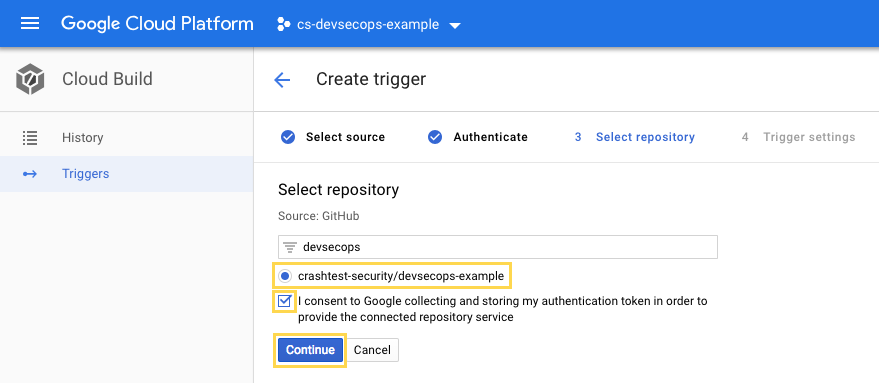
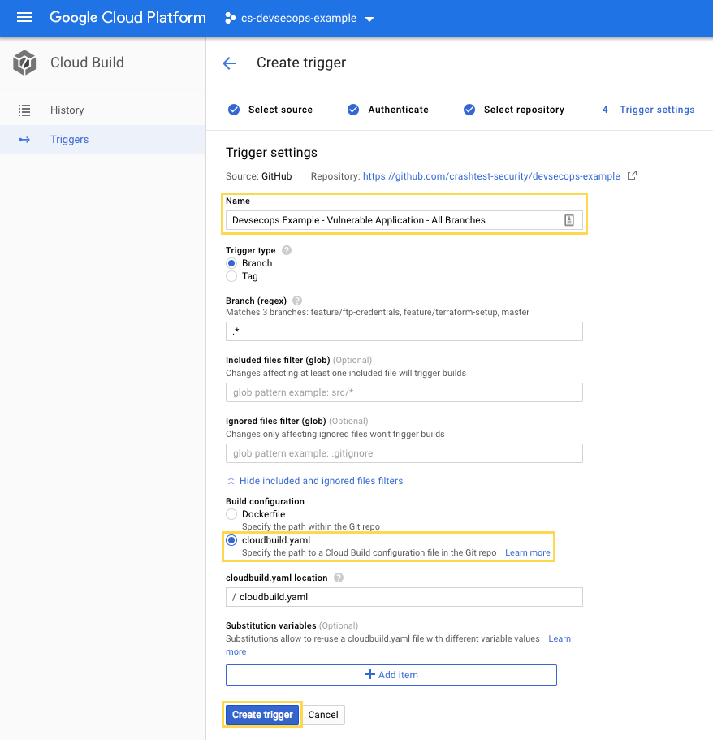

# DevSecOps Build Pipeline

This build pipeline uses the following tools to check an application for vulnerabilities in the order of their usage.

- [Python Safety Check](https://github.com/pyupio/safety) (for checking python requirements)
- [Google Cloud Repository](https://cloud.google.com/container-registry/) (for checking Docker containers)
- [Crashtest Security Suite](https://crashtest-security.com) (for a dynamic code analysis)

## Getting Started

### Terraform

Login to the `gcloud` CLI using an organisation administrator account:

```bash
gcloud auth login
```

Create a project for this demo and link your billing account. Note that you need
to enable the billing API before linking the billing account. You do not need to
worry about the cost. This small example will not create high costs, because it
only uses Google Cloud  Build, which has a generous free contingent, and Google
App Engine.

```bash
gcloud projects create cs-devsecops-example --organization <YOUR_ORG_ID>
gcloud config set project cs-devsecops-example
gcloud services enable cloudbilling.googleapis.com
gcloud beta billing projects link cs-devsecops-example --billing-account <YOUR_BILLING_ACCOUNT_ID>
```

Run the following to create an App Engine application for your project.

```bash
gcloud app create
```

Furthermore we need to create a service account, which could be used by
Terraform to provision and configure our project.

```bash
gcloud iam service-accounts create terraform --display-name "Terraform Admin Account"
gcloud projects add-iam-policy-binding cs-devsecops-example --member serviceAccount:terraform@cs-devsecops-example.iam.gserviceaccount.com --role roles/viewer 
gcloud iam service-accounts keys create ./terraform-account.json --iam-account terraform@cs-devsecops-example.iam.gserviceaccount.com
```

Finally apply the Terraform plan by running the following command.

```bash
terraform apply
```

### Google Cloud Build

Please make sure to fork this repository on GitHub before you continue with the
steps below. Google Cloud Build requires the repository to be accessible via your
account.

Open the Google Cloud console and navigate to the [Google Cloud Build triggers](https://console.cloud.google.com/cloud-build/triggers).
Click "Add trigger" to start registering the forked repository.



For this example select "GitHub" as repository source and click "Continue".



Afterwards you will be redirected to the GitHub authorization page for the 
"Google Cloud Platform Backwards Compatibility" application (really creative
name for the application ;)). Grant access by clicking
"Authorize Google-Cloud-Development". You will receive a notification that this
account registered a new SSH key into your account, which is required to clone
your repositories for building.



In the next step you will need to select the repository. Depending on the amount
of repositories in your GitHub account it might be helpful to filter the list
(e.g. by "devsecops"). Select the previously forked GitHub repository, accept
the storage of your GitHub authentication token and click "Continue".



Finally the settings have to be specified. Give your trigger a name (e.g. 
"Devsecops Example - Vulnerable Application - All Branches") and select the 
"cloudbuild.yaml" build configuration option. The build configuration file is 
located in the application folder. Click "Create trigger" to complete the 
configuration.



**Note:** To keep it simple this build trigger is executed for commits on all
branches. In your productive configuration you probably want to create multiple
build configurations for (e.g. master, develop and feature branches).